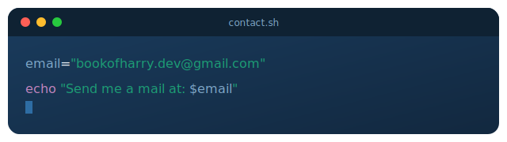
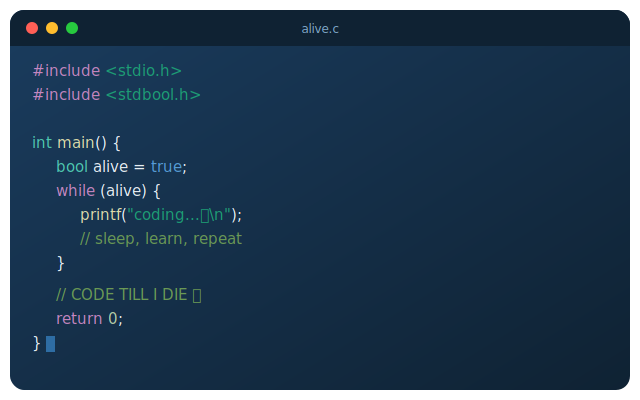

  

 

## 01. Profile

<table>
<tr>
<td width="100%">

Software engineer, technical instructor, and AI systems builder with **4+ years** shipping scalable web and mobile products. Full-stack across React, Next.js, Node.js, and PostgreSQL, with production experience in agentic AI engineering — LLM integration, Model Context Protocol (MCP), multi-agent orchestration, and prompt engineering. Designed and delivered a **25-week Agentic Software Engineering curriculum**, and has led, co-built, and shipped live products across **SaaS, legal tech, marketplace, and healthcare**. Equally strong as an educator — mentoring developers from beginner to job-ready across bootcamp and professional cohorts.

</td>
</tr>
</table>

 

## 02. Stack

<table>
<tr>
<td valign="top" width="50%">

**Frontend**

**Backend**

</td>
<td valign="top" width="50%">

**AI / Agentic Engineering**

**Infrastructure & Tools**

</td>
</tr>
</table>

 

## 03. Experience

<table>
<tr><td width="100%">

**Lead Software Engineer** · Nevila Systems Ltd `Apr 2026 — Present`
Architecting and engineering across a full product portfolio spanning SaaS, marketplace, legal AI, and relationship platforms. Own backend systems, APIs, and frontend interfaces for multiple live products in parallel, plus technical standards and deployment infrastructure across all subsidiaries.

**Co-Developer / Curriculum Contributor** · Tech Minds Academy `Apr 2026 — Jun 2026`
Co-designed the 25-week Agentic Software Engineering programme — LLMs, MCP, multi-agent systems, full-stack. Built and maintained the student portal for enrollment and course tracking.

**Co-Founder & Co-Developer** · LexAI `Mar 2026 — May 2026`
Co-built an AI-powered legal document intelligence platform for contract analysis and compliance review. Integrated LLM-based document parsing, clause extraction, and compliance flagging, with CI/CD for continuous delivery.

**Lead Engineer** · Koventra Systems `Jan 2026 — May 2026`
Led engineering on LexAI end to end — system architecture, LLM integration for contract analysis, and legal compliance documentation (ToS, Privacy Policy, AUP).

**Solo Developer** · TeamPad `Feb 2026 — Apr 2026`
Independently designed and built a full-stack SaaS collaboration platform with real-time project management, a React frontend, and an E2E encrypted secrets vault with a social recovery model.

**Software Engineer** · Kindrr Bond `Jan 2026 — Present`
Building and maintaining web and mobile apps on React, React Native, Node.js, and PostgreSQL. Integrating auth and payments, implementing CI/CD, and shipping LLM-powered features and agentic workflows.

**Software Engineer** · Code Campus International `Mar 2025 — Present`
Remote instruction and mentorship across modern JavaScript stacks; contributes to student portal features and AI/agentic engineering curriculum.

**Lead Instructor** · Tech Minds Academy `Dec 2023 — Feb 2025`
Designed and delivered a full bootcamp curriculum — HTML/CSS, JavaScript, React, Node.js, backend development — mentoring cohorts from beginner to job-ready.

</td></tr>
</table>

 

## 04. Featured Work

<table>
<tr>
<td width="33%" valign="top">

**TeamPad**
Real-time SaaS collaboration platform. Solo-built — React frontend, Node.js backend, E2E encrypted secrets vault with social recovery.

`React` `Node.js` `PostgreSQL` `WebSockets`

</td>
<td width="33%" valign="top">

**LexAI**
AI-powered legal document intelligence platform for contract analysis and compliance review, built on LLM integration.

`LLM` `Node.js` `PostgreSQL` `Legal Tech`

</td>
<td width="33%" valign="top">

**VerifyBuy**
Live-video product verification marketplace enabling real-time buyer–seller transactions, with full CBN compliance documentation.

`React Native` `Node.js` `Marketplace`

</td>
</tr>
<tr>
<td width="33%" valign="top">

**Kindrr Bond**
Production mobile + web app with a token subscription model, KYC-gated features, and real-time communication.

`React Native` `Node.js` `KYC` `Payments`

</td>
<td width="33%" valign="top">

**D CindyCare**
Live healthcare platform for an eye care clinic — appointment booking and patient-facing services.

`Next.js` `Healthcare` `Booking`

</td>
<td width="33%" valign="top">

**Tech Minds Academy**
Registered tech bootcamp platform delivering practical coding training in Abuja across multiple student cohorts.

`Next.js` `EdTech` `Cohort Management`

</td>
</tr>
<tr>
<td width="33%" valign="top">

**Tech Minds Portal**
Custom student management system — enrollment, course tracking, progress reporting across bootcamp cohorts.

`Next.js` `Node.js` `PostgreSQL`

</td>
<td width="33%" valign="top">

**RentionOs** `In Progress`
Cloud-based OS for enterprise resource planning and management.

`Next.js` `Node.js` `Enterprise`

</td>
<td width="33%" valign="top">

**X Cloud** `In Progress`
Streaming and entertainment platform for movies and cloud-based content delivery.

`Next.js` `Streaming` `Cloud`

</td>
</tr>
</table>

 

## 05. GitHub Stats

  
  

  

 

## 06. Community & Recognition

<table>
<tr><td width="100%">

**GDG Cloud Abuja** — Active member and event organiser. Organised *Build with AI 2026* at Code Campus, Wuse 2, bringing Abuja developers together to explore AI engineering in practice.

**TikTok Educational Content** [`@deeptruthguy`](https://tiktok.com/@deeptruthguy) — Public developer education series for junior engineers, covering Docker, Node.js, REST APIs, authentication, system design, and AI engineering.

</td></tr>
</table>

 

## 07. Contact

  

 

 

